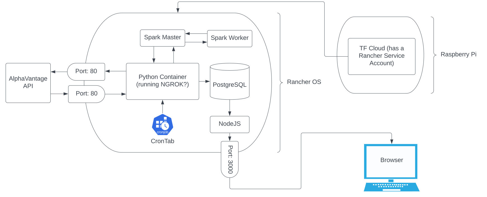

# dockerspark

## Setting up local spark env:

run `docker-compose up`

docker desktop and localhost:8080 in the browser can be used to monitor current status.

currently the ipynb file isn't connecting to the locally created cluster but this appears like it can be adjusted by changing the spark session `master()` parameter 

## Data Source(s):

<!-- currently using `bulk_export_sample` from crunchbase's sample daily csv dump. waiting on free API access -->

using alphaadvantage for free stock info: https://www.alphavantage.co/documentation/

## Current project direction:

https://databricks.com/blog/2020/01/27/time-series-forecasting-prophet-spark.html is a project doing price forecasting using spark and FB Prophet. It's looking at walmart data but could easily be adapted for stock price prediction

Right now only a few stocks are being queried. There needs to be more stocks being downloaded, analyzed and split into a train/val split. This should be done using a rate limiter since the alphaadvantage API only allows for 5 queries per minute.

## Notes on setting up rancher:

https://linuxhint.com/install_rancher_os/

had to run `sudo mkdir /dev/sr0` to get past `There is no boot iso drive, terminate the task` error
